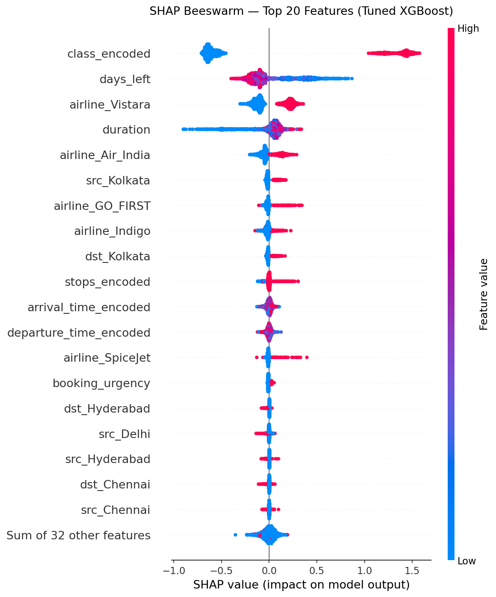
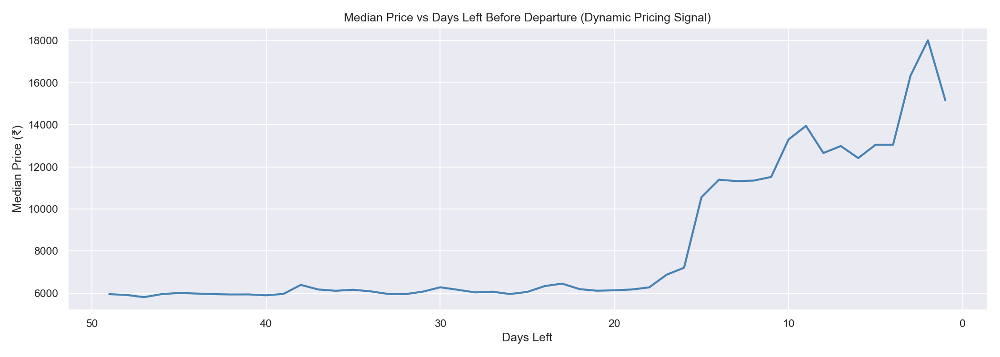

# Flight Dynamic Pricing — ML Price Prediction System

A supervised machine learning system that predicts optimal flight ticket prices based on booking conditions, trained on 300,000+ real Indian flight records.

**Live Demo → [Flight Dynamic Pricing App](https://flight-dynamic-pricing.streamlit.app/)**

---

## Results

| Model | RMSE | MAE | R² |
|---|---|---|---|
| Linear Regression (baseline) | ₹8,722 | ₹4,894 | 0.8524 |
| Random Forest | ₹3,722 | ₹1,896 | 0.9731 |
| XGBoost (tuned) | ₹2,710 | ₹1,315 | 0.9858 |

Hyperparameter tuning via Optuna (50 trials) improved RMSE by **24.7%** over baseline XGBoost.

---

## Key Findings (EDA + SHAP)

- **Class** is the single strongest pricing driver — Business tickets cost ~9x Economy on the same route
- **Days left before departure** is the core dynamic pricing signal — prices spike 3x in the last 17 days
- **Airline** is the third strongest feature — Vistara commands a significant premium over budget carriers (AirAsia, Indigo, SpiceJet)
- Linear Regression achieved only R²=0.85 — confirming the non-linear nature of flight pricing




---

## Project Structure

\```
flight-dynamic-pricing/
│
├── data/
│   └── raw/                    ← Original Kaggle CSVs (not tracked)
│
├── src/
│   ├── phase1_data_audit.py    ← Data loading, null check, shape audit
│   ├── phase2_eda.py           ← 8 EDA plots saved to outputs/eda/
│   ├── phase3_feature_engineering.py  ← Encoding, log transform, feature creation
│   ├── phase4_modeling.py      ← Linear Regression, Random Forest, XGBoost
│   ├── phase4b_tuning.py       ← Optuna hyperparameter tuning (50 trials)
│   └── phase5_shap.py          ← SHAP beeswarm, bar, dependence, waterfall plots
│
├── models/
│   ├── xgboost_tuned.json      ← Final tuned model
│   ├── best_params.pkl         ← Optuna best hyperparameters
│   └── feature_columns.pkl     ← Feature column order for inference
│
├── outputs/
│   ├── eda/                    ← 8 EDA plots + insights markdown
│   └── shap/                   ← 6 SHAP plots
│
├── app.py                      ← Streamlit app
├── requirements.txt
└── README.md
\```

## Feature Engineering

| Feature | Type | Source | Rationale |
|---|---|---|---|
| `price_log` | Target | `log1p(price)` | Right-skewed distribution |
| `class_encoded` | Binary | `class` | Economy=0, Business=1 |
| `stops_encoded` | Ordinal | `stops` | zero=0, one=1, two_or_more=2 |
| `departure_time_encoded` | Ordinal | `departure_time` | Ranked by median price |
| `booking_urgency` | Engineered | `days_left` | 0=early(50+), 1=medium(17-49), 2=last_minute(0-16) |
| `airline_*` | One-hot | `airline` | 5 airline dummy columns |
| `route_*` | One-hot | source+destination | 29 route dummy columns |

---

## How to Run Locally

```bash
# Clone the repo
git clone https://github.com/AdvaithAjithkumar/flight-dynamic-pricing
cd flight-dynamic-pricing

# Create virtual environment
python -m venv venv
venv\Scripts\activate  # Windows
source venv/bin/activate  # Mac/Linux

# Install dependencies
pip install -r requirements.txt

# Download dataset from Kaggle
# https://www.kaggle.com/datasets/shubhambathwal/flight-price-prediction
# Place Clean_Dataset.csv in data/raw/

# Run pipeline
python src/phase1_data_audit.py
python src/phase2_eda.py
python src/phase3_feature_engineering.py
python src/phase4_modeling.py
python src/phase4b_tuning.py
python src/resave_model.py
python src/phase5_shap.py

# Launch app
streamlit run app.py
```

---

## Dataset

- **Source:** [Kaggle — Flight Price Prediction](https://www.kaggle.com/datasets/shubhambathwal/flight-price-prediction)
- **Records:** 300,153 flights
- **Airlines:** Vistara, Air India, Indigo, GO_FIRST, AirAsia, SpiceJet
- **Routes:** 6 Indian cities (Delhi, Mumbai, Bangalore, Chennai, Kolkata, Hyderabad)
- **Features:** 10 raw → 51 engineered

---

## Tech Stack

Python · XGBoost · Optuna · SHAP · Scikit-learn · Pandas · Streamlit · Seaborn · Matplotlib
